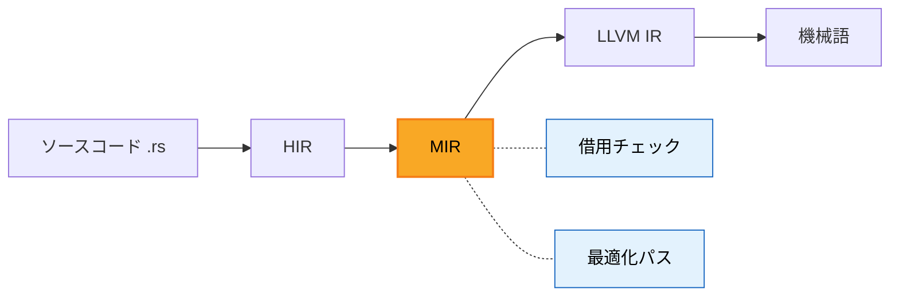

## 目次

- 前提となる技術要素
  - MIR (Mid-level Intermediate Representation) とは
  - bisect（二分探索デバッグ）とは
- 作成したPRに至る経緯
- 使用例 ── 実際に動かしてみる
- ケーススタディ ── bisectでバグの原因パスを特定する
- 実装の解説 ── なぜAtomicUsizeなのか
  - Cellに変えるとどうなるか
  - Ordering::Relaxedの選択
- このPRが抱える課題
  - 並列コンパイルとの非決定性
  - インクリメンタルコンパイルとの非互換
  - Hash-based bisectという代替案
- 最後に


## 前提となる技術要素

今回の経緯や実装内容をお話しする前に、関連する2つのキーワードについて簡単に整理しておきます。

### MIR (Mid-level Intermediate Representation) とは

MIRは、Rustコンパイラの内部表現の一つです。ソースコード → HIR → **MIR** → LLVM IR → 機械語という変換パイプラインの中間に位置します。



HIR（高レベル）はRustの構文に近い表現、LLVM IR（低レベル）は機械語に近い表現です。MIRはその中間で、**所有権チェック（借用チェッカー）** や **最適化** を行うために設計されています。

MIRは関数ごとに生成され、基本ブロック（BasicBlock）の制御フローグラフ（CFG）として表現されます。そして、このMIRに対して複数の「最適化パス」が順番に適用されます。例えば `SimplifyCfg`（制御フローの簡略化）、`CopyProp`（コピー伝播）、`RemoveZsts`（ゼロサイズ型の除去）などです。

これらのパスは `compiler/rustc_mir_transform/src/pass_manager.rs` で管理されています。

### bisect（二分探索デバッグ）とは

コンパイラの最適化パスは通常数十個が順番に適用されます。もしある最適化パスにバグがあった場合、**どのパスが原因か**を特定しなければなりません。

- 素朴なアプローチ：パスを1つずつ無効化して試す → パスが50個あれば50回の試行が必要
- bisect（二分探索）アプローチ：「最初のN個だけ実行」というリミットを設定し、二分探索で問題のパスを絞り込む → **O(log N)** で特定可能

```
パス1 → パス2 → ... → パス25 → パス26 → ... → パス50
                        ↑ limit=25なら、ここまで実行
                                   ↑ ここからスキップ

「limit=25で正常、limit=26でバグ」→ パス26が原因
```

これはLLVMに `-opt-bisect-limit` として既に存在する機能です。本PRはこの概念をRustのMIR最適化パスに導入しました。


## 作成したPRに至る経緯

今回のPRを作成したきっかけは、レビュアーの [saethlin](https://github.com/saethlin) さんが作成した Issue [#150910](https://github.com/rust-lang/rust/issues/150910) でした。

> `-Zmir-enable-passes=+SimplifyCfg` doesn't enable any passes and doesn't warn

「特定のMIR最適化パスを有効にしようとしても機能しないし、警告も出ない」という問題です。このissueをきっかけに [Zulipでの議論](https://rust-lang.zulipchat.com/#narrow/channel/182449-t-compiler.2Fhelp/topic/MIR.20dump.20the.20pass.20names/with/573219207)が始まり、最終的に「パス名のダンプだけでなく、bisect機能自体を実装しよう」という方向に発展しました。

作成したPRの概要は以下の通りです。

- `-Zmir-opt-bisect-limit=N` というコンパイラフラグを新設
- Nまでの最適化パスだけを実行し、残りをスキップする
- 変更は計5ファイル、+198行 / -1行


## 使用例 ── 実際に動かしてみる

まず、以下のようなシンプルなコードを用意します。

```rust
fn abs(num: isize) -> usize {
    if num < 0 { -num as usize } else { num as usize }
}

fn main() {
    println!("{}", abs(-10));
}
```

`./x setup` および `./x build --stage 1 compiler library` でstage1コンパイラをビルドし、`rustup toolchain link stage1` で登録した上で、`-Zmir-opt-bisect-limit=30` を指定してコンパイルすると、以下のような出力が得られます。

```shell
$ rustc +stage1 -Zmir-opt-bisect-limit=30 src/main.rs
BISECT: running pass (1) CheckAlignment on main[acb8]::main
BISECT: running pass (2) CheckNull on main[acb8]::main
BISECT: running pass (3) CheckEnums on main[acb8]::main
...
BISECT: running pass (24) PreCodegen on main[acb8]::main
BISECT: running pass (25) CheckAlignment on main[acb8]::abs
...
BISECT: running pass (30) ForceInline on main[acb8]::abs
BISECT: NOT running pass (31) RemoveStorageMarkers on main[acb8]::abs
BISECT: NOT running pass (32) RemoveZsts on main[acb8]::abs
...
BISECT: NOT running pass (48) PreCodegen on main[acb8]::abs
```

- `running pass` = 実行されたパス、`NOT running pass` = スキップされたパス
- limit=30の場合、30番目までが実行され、31番目以降はスキップ

ここで重要なのは、**関数ごとではなく、すべての関数のパスがグローバルに通し番号で管理される**ということです。`main`関数の24パスが終わった後に `abs` 関数のパスが続きます。これにより、「limit=30では正常だがlimit=31ではクラッシュする」という状況から、31番目のパス（`RemoveStorageMarkers on abs`）が原因だと即座に特定できます。


## ケーススタディ ── bisectでバグの原因パスを特定する

bisectの真価を示すため、実際にCopyPropパスにバグを埋め込み、それをbisectで特定する実験を行いました。

### バグの内容

`compiler/rustc_mir_transform/src/copy_prop.rs` の `run_pass` 末尾に、以下のコードを追加しました。

```rust
// Neg（符号反転）操作を含む関数でのみ発動する条件付きバグ。
// 現実のコンパイラバグでも、特定のMIR構造が揃ったときだけ
// 発現するケースは珍しくない。
let has_neg = body.basic_blocks.iter().any(|bb| {
    bb.statements.iter().any(|stmt| {
        matches!(
            &stmt.kind,
            StatementKind::Assign(box (_, Rvalue::UnaryOp(UnOp::Neg, _)))
        )
    })
});

if has_neg {
    for block in body.basic_blocks_mut() {
        if let TerminatorKind::SwitchInt { ref mut targets, .. } =
            block.terminator_mut().kind
        {
            let all_targets = targets.all_targets_mut();
            if all_targets.len() >= 2 {
                // switchIntのジャンプ先を入れ替える。
                // これにより if の then と else が逆転する。
                all_targets.swap(0, all_targets.len() - 1);
            }
        }
    }
}
```

このバグは、Neg（`-x` のような符号反転）を含む関数に対してのみ `switchInt` の分岐先を反転させます。`abs()` は `-num` を含むのでバグの対象になりますが、標準ライブラリの大半の関数には影響しません。

### バグの発現

バグ入りコンパイラで `abs(-10)` をコンパイル・実行すると：

```shell
$ rustc +stage1 src/main.rs -o abs_buggy && ./abs_buggy
18446744073709551606
```

期待値の `10` ではなく `18446744073709551606` が出力されました。これは `-10` を符号なし64bit整数（`usize`）にそのままキャストした値であり、if文の分岐が逆転していることを示しています。

### bisectによる原因特定

bisect-limitを変化させながら各limit値でプログラムの出力を確認していきます。

```shell
limit=0  → 10 (正常)
limit=1  → 10 (正常)
...
limit=44 → 10 (正常)
limit=45 → 18446744073709551606 (バグ!)
limit=46 → 18446744073709551606 (バグ!)
...
limit=48 → 18446744073709551606 (バグ!)
```

**limit=44で正常、limit=45でバグが発現**します。45番目のパスを確認すると：

```shell
$ rustc +stage1 -Zmir-opt-bisect-limit=48 src/main.rs -o /tmp/test 2>&1 | grep "pass (4[3-6])"
BISECT: running pass (43) RemoveNoopLandingPads on main[acb8]::abs
BISECT: running pass (44) SimplifyCfg-final on main[acb8]::abs
BISECT: running pass (45) CopyProp on main[acb8]::abs        ← 犯人
BISECT: running pass (46) SimplifyLocals-final on main[acb8]::abs
```

**パス(45) `CopyProp on abs` が原因であると即座に特定できました。**

実際の運用では全数探索する必要はなく、二分探索（`limit=24 → OK, limit=36 → OK, limit=42 → OK, limit=45 → NG, limit=44 → OK`）を行えば、48パスの中から **わずか5〜6回の試行** で原因パスを絞り込めます。


## 実装の解説 ── なぜAtomicUsizeなのか

今回の実装で、一エンジニアとして「非常に面白い！」と感じた部分をお話しします。

### カウンタの仕組み

本機能の中核はシンプルなカウンタです。`Session`構造体にグローバルなカウンタを持ち、各最適化パスの実行前にインクリメントして、limit値と比較します。

```rust
// compiler/rustc_session/src/session.rs
pub struct Session {
    // ...
    pub mir_opt_bisect_eval_count: AtomicUsize,
}
```

```rust
// compiler/rustc_mir_transform/src/pass_manager.rs
fn limited_by_opt_bisect<'tcx, P>(
    tcx: TyCtxt<'tcx>,
    def_path: String,
    limit: usize,
    pass: &P,
) -> bool {
    let current_opt_bisect_count =
        tcx.sess.mir_opt_bisect_eval_count.fetch_add(1, Ordering::Relaxed);

    let can_run = current_opt_bisect_count < limit;
    // ...
    !can_run
}
```

`fetch_add(1, Ordering::Relaxed)` で、現在の値を取得しつつアトミックに+1する操作を行っています。

### なぜAtomicが必要なのか

Rustコンパイラは `-Zthreads=N` で並列コンパイルが可能です。つまり、複数スレッドが同時にMIR最適化パスを実行しうるということです。

もし通常の `usize` を使った場合、以下のようなデータ競合が発生します。

```rust
// ❌ データ競合が発生する例
let count = self.counter;      // スレッドAが読む: 5
                                // スレッドBも読む: 5（まだAが書き込んでない）
self.counter = count + 1;      // スレッドAが書く: 6
                                // スレッドBも書く: 6（本来は7であるべき）
```

2つのスレッドが同時にカウンタを読み取ると、同じ値を読んでしまい、インクリメントが1回分消失します（lost update）。

ただし、Rustではそもそも `usize` を複数スレッドで共有しようとするとコンパイルエラーになります。`Sync` トレイトを実装していないためです。Rustの型システムがデータ競合を**コンパイル時に**防いでくれるわけです。

`AtomicUsize` は CPU のアトミック命令（x86の`lock xadd`等）を使い、読み取り→加算→書き込みを**一つの不可分な操作**として実行します。

### 実験：AtomicUsizeをCell\<usize\>に変えてみる

「型システムが本当にデータ競合を防ぐの？」という疑問を検証するため、実際に `AtomicUsize` を `Cell<usize>` に変えてコンパイラをビルドしてみました。`Cell<usize>` は単一スレッドでの内部可変性を提供しますが、スレッド安全ではありません。

```rust
// compiler/rustc_session/src/session.rs
// Before:
pub mir_opt_bisect_eval_count: AtomicUsize,
// After:
pub mir_opt_bisect_eval_count: Cell<usize>,

// compiler/rustc_mir_transform/src/pass_manager.rs
// Before:
let current_opt_bisect_count =
    tcx.sess.mir_opt_bisect_eval_count.fetch_add(1, Ordering::Relaxed);
// After:
let current_opt_bisect_count = tcx.sess.mir_opt_bisect_eval_count.get();
tcx.sess.mir_opt_bisect_eval_count.set(current_opt_bisect_count + 1);
```

結果はコンパイルエラーです。

```
error[E0277]: `Cell<usize>` doesn't implement `DynSync`.

   --> compiler/rustc_middle/src/ty/context.rs:754:29
    |
754 |     sync::assert_dyn_sync::<&'_ GlobalCtxt<'_>>();
    |                             ^^^^^^^^^^^^^^^^^^ within `GlobalCtxt<'_>`,
    |                             the trait `DynSync` is not implemented for `Cell<usize>`
    |
note: required because it appears within the type `Session`
   --> compiler/rustc_session/src/session.rs:98:12
    |
 98 | pub struct Session {
    |            ^^^^^^^
```

`Cell<usize>` は `Sync`（`DynSync`）を実装していないため、スレッド間で共有される `Session` 構造体のフィールドとして使用できません。`Session` → `GlobalCtxt` → スレッド間共有、という依存の連鎖を型システムが追跡し、**コンパイル時に**安全でない共有を検出しています。

つまり、Rustでは「うっかりスレッドセーフでない型を使う」こと自体が不可能であり、`AtomicUsize` の使用はコンパイラによって強制されているということです。

### `Ordering::Relaxed` の選択

Atomic操作には複数のメモリオーダリングがあります。`Relaxed`, `Acquire`, `Release`, `SeqCst` などです。

- `Relaxed` は最も緩い保証で、「アトミック操作自体の不可分性」だけを保証し、他のメモリ操作との順序関係は保証しない
- ここでは「カウンタ値が正確にインクリメントされること」だけが重要で、パス間の実行順序の可視性は問題にならない（もともと並列実行時のパス順序は非決定的）ため、`Relaxed` で十分
- `SeqCst`（最も強い保証）を使えばスレッド間でカウンタの進行が厳密に見えるが、パフォーマンスコストがある割にこの用途では恩恵がない


## このPRが抱える課題

機能としてはマージされましたが、レビューの過程でいくつかの課題が指摘されています。ここでは、それぞれの課題について実験結果も交えながら紹介します。

### 1. 並列コンパイル（`-Zthreads`）との非決定性

レビュアー saethlin のコメント：

> This might have weird interactions with -Zthreads, but I don't see a coherent way to resolve that

`-Zthreads=4` のように並列度を上げると、関数の最適化がどの順序で実行されるかが実行ごとに変わりえます。つまり、同じ `limit=30` でも実行ごとに「30番目のパス」が異なる関数の異なるパスを指す可能性があります。

bisectの再現性が損なわれるため、テストでは `-Zthreads=1` を明示的に指定して回避しています。

```rust
// tests/run-make/mir-opt-bisect-limit/rmake.rs
cmd.arg("-Zthreads=1")  // 並列性を排除して再現性を確保
```

なお、実際に `-Zthreads=8` で100関数のプログラムを5回コンパイルする実験を行ったところ、パスの割り当て順序は毎回一致しました。現状ではクエリシステムが関数を決定的な順序で処理するため、小〜中規模のプログラムでは非決定性が顕在化しにくいようです。ただし、大規模なプロジェクトやスレッドスケジューリングの揺らぎにより理論上は発生しうるため、テストでは `-Zthreads=1` が明示的に指定されています。

### 2. インクリメンタルコンパイルとの非互換

レビュアー [bjorn3](https://github.com/bjorn3) のコメント：

> We used to have optimization fuel in the session, but removed it in [#115293](https://github.com/rust-lang/rust/pull/115293)

過去にも似た機能（`-Zfuel`）が存在しましたが、**インクリメンタルコンパイルと非互換**であるとして[削除されていました](https://github.com/rust-lang/rust/pull/115293)。本PRも同じ問題を抱えています。

実際に再現してみましょう。まず、2つの関数（`abs` + `main`）をインクリメンタルコンパイルで初回ビルドします。

```shell
# 1回目: 初回コンパイル
$ rustc +stage1 -Zmir-opt-bisect-limit=999 -Cincremental=./incr src/main.rs
BISECT: running pass (21) CopyProp on main::main
BISECT: running pass (45) CopyProp on main::abs    ← absのCopyPropはパス45
```

次に、コードを変更せず再コンパイルします。

```shell
# 2回目: 変更なしで再コンパイル
$ rustc +stage1 -Zmir-opt-bisect-limit=999 -Cincremental=./incr src/main.rs
（BISECT出力なし — すべてキャッシュから復元され、MIR最適化は実行されない）
```

最後に、`abs` の前に新しい関数 `double` を追加して再コンパイルします。

```rust
fn double(x: usize) -> usize { x * 2 }   // ← 追加

fn abs(num: isize) -> usize {
    if num < 0 { -num as usize } else { num as usize }
}

fn main() {
    println!("{}", double(5));
    println!("{}", abs(-10));
}
```

```shell
# 3回目: double関数を追加して再コンパイル
$ rustc +stage1 -Zmir-opt-bisect-limit=999 -Cincremental=./incr src/main.rs
BISECT: running pass (21) CopyProp on main::main
BISECT: running pass (45) CopyProp on main::double  ← パス45がdoubleに!
```

`abs` はコード変更がないため、インクリメンタルキャッシュからMIRが復元され、最適化パスが実行されませんでした。代わりに新しい `double` 関数がパス(45)を取っています。

| コンパイル | パス(45)の対象 |
|---|---|
| 1回目 | `CopyProp on abs` |
| 3回目 | `CopyProp on double` |

**同じ `limit=45` が、1回目は `abs` のCopyProp、3回目は `double` のCopyPropを指す。** bisectの前提である「同じlimit値は常に同じパスを指す」が完全に崩壊しており、インクリメンタルコンパイルとbisectを併用すると原因パスの特定が不可能になります。

bjorn3は「`Session`にカウンタを持つとインクリメンタルコンパイルが壊れるが、簡単な回避策はない」と述べています。

### 3. Hash-based bisectという代替案

コントリビューター [hanna-kruppe](https://github.com/hanna-kruppe) からは、根本的に異なるアプローチが提案されました。

> an interesting alternative that avoids this problem is [hash based bisect](https://research.swtch.com/bisect)

Goコンパイラが採用している手法で、各最適化対象を**ハッシュ値**で識別します。カウンタ方式（本PR）の代わりに、ハッシュの末尾ビットパターンでパスの有効/無効を制御する仕組みです。

- **利点**：実行順序・スレッド数に依存しない。並列コンパイルでも完全に再現可能
- **欠点**：実装が複雑。手動での二分探索が困難で、専用の自動化ツールが必要

本PRは「デバッグツールとしてはgood enough」という判断でマージされましたが、将来的にはhash-based方式への移行が検討されうるアプローチです。
